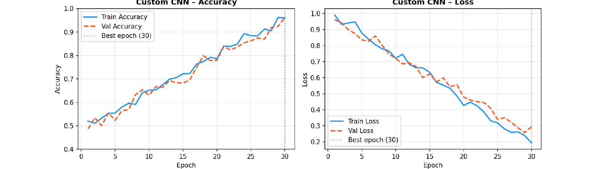
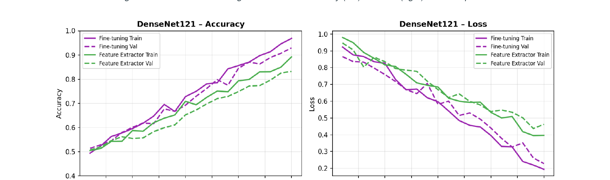
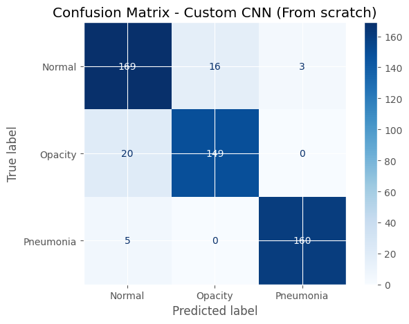

# Applied AI Image Classification

Portfolio-grade computer vision project for multiclass chest X-ray classification using a custom convolutional neural network and transfer learning benchmark.

This repository is a cleaned, independent portfolio version of an Applied AI learning project. It does not include university briefs, answer sheets, rubrics, private assessment files, zipped submissions or restricted datasets.

## Problem Statement

Chest X-ray interpretation is a high-volume clinical imaging task where machine learning can support screening and triage. This project explores whether a compact custom CNN can classify chest X-ray images into three categories:

- Normal
- Opacity
- Pneumonia

The goal is not to present a deployable medical device. The goal is to demonstrate a careful image-classification workflow: data splitting, preprocessing, augmentation, model comparison, evaluation and responsible limitations.

## Dataset

The original experiment used 3,475 chest X-ray images:

| Class | Images |
|---|---:|
| Normal | 1,250 |
| Opacity | 1,125 |
| Pneumonia | 1,100 |
| Total | 3,475 |

The data was split using a stratified 70/15/15 train-validation-test split:

| Split | Images |
|---|---:|
| Training | 2,432 |
| Validation | 521 |
| Test | 522 |

The dataset is not included in this repository. To run the code, provide your own permitted image dataset in this structure:

```text
data/
  train/
    Normal/
    Opacity/
    Pneumonia/
  val/
    Normal/
    Opacity/
    Pneumonia/
  test/
    Normal/
    Opacity/
    Pneumonia/
```

## Methods

### Preprocessing

- Resize images to 224 x 224 pixels.
- Convert greyscale images to three-channel RGB when needed.
- Normalise using ImageNet mean and standard deviation for transfer-learning compatibility.

### Data Augmentation

Training images use conservative augmentation suitable for radiography-style images:

- Random resized crop with small scale and aspect-ratio variation.
- Mild rotation.
- Mild brightness and contrast adjustment.

Validation and test images are not augmented.

### Models

The project compares:

- Custom CNN trained from scratch.
- DenseNet121 as a frozen feature extractor.
- DenseNet121 fine-tuned end to end.

The custom CNN uses five convolutional blocks with batch normalisation, ReLU activations, max pooling, dropout and global average pooling before the classifier head.

## Results

The custom CNN was selected based on validation performance and then evaluated once on the held-out test set.

### Validation Comparison

| Model | Strategy | Trainable Parameters | Best Validation Accuracy |
|---|---|---:|---:|
| Custom CNN | From scratch | 3,436,259 | 0.9405 |
| DenseNet121 | Fine-tuning | 6,956,931 | 0.9386 |
| DenseNet121 | Feature extractor | 3,075 | 0.8426 |

### Test Metrics for Selected Custom CNN

| Metric | Score |
|---|---:|
| Accuracy | 0.9157 |
| Macro Precision | 0.9186 |
| Macro Recall | 0.9168 |
| Macro F1-score | 0.9175 |
| Balanced Accuracy | 0.9168 |
| Cohen's Kappa | 0.8733 |

### Per-Class Test Performance

| Class | Precision | Recall | F1-score | Support |
|---|---:|---:|---:|---:|
| Normal | 0.8963 | 0.9043 | 0.9003 | 188 |
| Opacity | 0.9134 | 0.8817 | 0.8973 | 169 |
| Pneumonia | 0.9460 | 0.9697 | 0.9577 | 165 |

## Visual Results

### Custom CNN Training Curves



### DenseNet121 Training Curves



### Confusion Matrix



## Key Findings

- A well-regularised custom CNN performed competitively against DenseNet121 on this dataset.
- The custom CNN achieved 91.57% test accuracy and macro F1-score of 0.9175.
- Pneumonia was the strongest class, with recall of 0.9697.
- The main error pattern was Opacity being predicted as Normal, which is plausible because mild opacity can be visually subtle.

## Limitations

- This is an educational portfolio project, not a clinical tool.
- Results come from one stratified split, so cross-validation would give a stronger estimate of stability.
- The dataset is moderate in size, and small differences between Custom CNN and DenseNet121 fine-tuning may not generalise.
- Medical imaging datasets can contain scanner, site, demographic and labelling biases.
- No external validation dataset was used.
- No explainability method such as Grad-CAM is included yet.

## Future Improvements

- Add Grad-CAM visual explanations for model predictions.
- Evaluate on an external validation dataset.
- Add cross-validation or repeated stratified splits.
- Explore class-specific thresholding and calibration.
- Add experiment tracking with MLflow or Weights & Biases.
- Package a lightweight Streamlit demo using a clearly non-clinical disclaimer.

## Run Locally

Create an environment and install dependencies:

```bash
python -m venv .venv
.venv\Scripts\activate
pip install -r requirements.txt
```

Train the custom CNN:

```bash
python src/train.py --data-dir data --model custom_cnn --epochs 30 --output-dir outputs
```

Fine-tune DenseNet121:

```bash
python src/train.py --data-dir data --model densenet121 --strategy finetune --epochs 10 --output-dir outputs
```

Evaluate a checkpoint:

```bash
python src/evaluate.py --data-dir data --checkpoint outputs/best_model.pt --model custom_cnn --output-dir outputs
```

## Repository Ethics

This public repository contains a cleaned portfolio implementation and selected result plots only. It intentionally excludes raw assessment submissions, course documents, private university material and any restricted dataset files.
